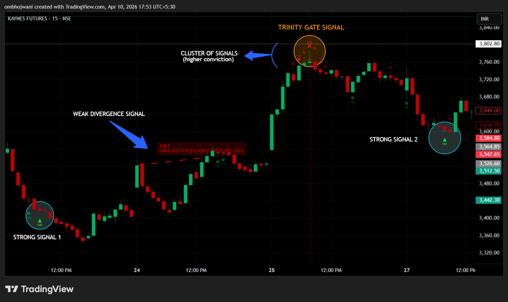

# OA — TradingView Overlay Indicator

OA is a Pine Script v6 overlay indicator for TradingView. It combines volume analysis, price structure, and momentum divergence into two types of signals: **Spike Signals** and **Divergence Signals**. Both work across NSE stocks and futures, MCX commodities, and BSE instruments.

---

## What It Does

### Spike Signals
These appear on individual candles and mark bars where multiple independent conditions aligned — volume, delta, momentum etc.— in a way that historically precedes reversals. Every spike is scored. The score reflects how convincingly the conditions aligned on that specific bar relative to the instrument's own history. Stronger alignment = higher score = higher tier.

*Example: OA V6 identifying structural exhaustion, tracking clusters of weak signals, and firing graded Strong (triangle) signals on SOLARINDS.*

Three tiers:
- **Circle (Weak):** Signal fired, conditions met minimum threshold.
- **Triangle (Strong):** Higher alignment, multiple components agreed.
- **Cross (Super):** Highest conviction, all components aligned simultaneously (Trinity Gate).

Green/red = signal direction. The number shown on each signal is the raw score for that bar.

### Divergence Signals
A separate system that detects divergence between price and internal buying/selling pressure over a rolling lookback window. When price is falling but internal buying pressure is rising (or vice versa), a divergence line is drawn with a score breakdown label. It extends as long as the divergence continues and seals when it stops.

*Example: OA V6 tracking a weak divergence signal alongside a high-conviction Trinity Gate confluence (Cross) on KAYNES.*

Score breakdown in the label shows which components contributed and how many points each added.

### Technical Profile
* **Framework:** Pine Script v6
* **Scale:** 1,300+ lines of proprietary quantitative logic
* **Platform:** TradingView

---

## Instruments

Works on any instrument with volume data. Built specifically for:

- **NSE & BSE** — stocks and F&O futures
- **MCX** — crude oil, gold, silver, natural gas, copper, zinc, aluminium

The correlation filter auto-detects the reference instrument for each symbol (Nifty for NSE stocks, BankNifty for bank instruments, CrudeOil1! for MCX crude, etc.) with no manual configuration.

---

## Recommended Timeframes

| Timeframe | Calibration Period |
|---|---|
| 15 min | 100 (default) |
| 5 min | 150–200 |
| Daily | 200–250 |

The calibration period controls how many bars are used to build the instrument's own volatility and volume baselines. Longer = more stable baseline. Shorter = more reactive.

---

## Settings Reference

### ADAPTIVE CALIBRATION
- **Calibration Period** — number of bars used to compute the instrument's own volume/volatility baseline. This affects thresholds, percentile cutoffs, and all adaptive parameters.
- **Sensitivity** — multiplier on the OI significance threshold. Higher = stricter OI filter.

### ADVANCED FILTERS
- **News Event Filter** — when enabled, raises the spike threshold if a bar has both anomalous volume AND anomalous range simultaneously. Prevents genuine signal criteria from firing through news/circuit bars. Off by default.
- **News Threshold Mult** — how much harder the threshold becomes during a detected news event. Set high (3.0–5.0) to effectively block news bars.
- **News Detection Bars** — how many recent bars are checked for the dual-condition news trigger.
- **Correlation Filter** — raises the threshold when a spike signal is counter-trend to the auto-detected reference instrument. On by default.
- **Counter-Trend Mult** — how much harder the threshold becomes for a counter-trend signal.

### OPEN INTEREST
- **OI Suffix** — appended to the ticker to find the OI data stream (default: `1!` for continuous futures).
- **Bar Coloring** — toggle OI-based candle border coloring.
- **Dashboard** — shows OI value, % change, and status in the stats table.
- **Intraday OI** — uses the chart timeframe for OI data instead of daily.
- **Lookback** — how many bars back OI change is measured.

### SPIKE WEIGHTS
Weights are assigned to each entry condition and component. These control how much each condition contributes to the spike score. Adjustable but defaults are calibrated for balanced detection. The meaning of each entry condition is not disclosed.

### COMPONENT SCALING
- **Component Floor Ratio** — controls how much a barely-qualifying component contributes relative to a maxed-out component. At 0.2 (default), a component at its minimum qualifying reading contributes 20% of its weight. At 1.0, all qualifying components contribute their full weight regardless of reading strength. Lower = more separation between weak and strong signals.

### SIGNAL TIERS (BREADTH)
Tier classification uses breadth — how many of 5 independent components agreed on a given bar.
- **Strong Tier: Min Breadth** — minimum number of components that must agree for a triangle signal.
- **Super Tier: Min Breadth** — minimum for a cross signal.

### OVERRIDES
Manual overrides for adaptive parameters. Off by default — the indicator adapts these automatically based on the instrument's volatility profile. Turn on only if you want to pin a specific value.

---

## Stats Table

The live table in the top-right corner shows the current state of every major component for the last bar. Useful for understanding why a signal did or didn't fire on a specific bar.

---

## Alerts

Four alert conditions are available:
- **SPIKE LONG** — fires on strong or super long spike signals
- **SPIKE SHORT** — fires on strong or super short spike signals
- **BULL TRAP** — fires when a bull trap is detected
- **BEAR TRAP** — fires when a bear trap is detected

---

## Disclaimer

**Proprietary Software:** The source code, core detection logic, and scoring matrix for this indicator are proprietary and not publicly distributed. This repository serves strictly as technical documentation and a portfolio demonstration of the system's architecture.
